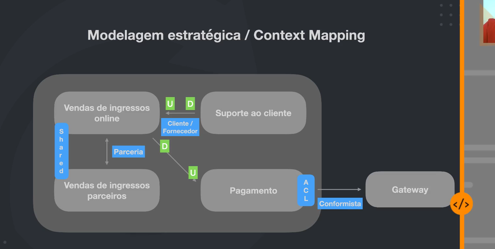

Modelagem Estratégica/Context Mapping

Contextos:
 - Vendas de ingressos online
 - Venda de ingressos parceiros
 - Suporte ao cliente
 - Pagamento

 

https://github.com/ddd-crew/context-mapping
 Padrões de Context Mapping
  - Partnership
  - Shared Kernel
  - Customer-Supplier Development
  - Conformist
  - Anticorruption-layer
  - Open host service
  - Published language
  - Separate ways
  - Big Ball of Mud

  resumo do módulo um pouco superficial, tem boas informações, mas é um pouco corrido demais, se bem q essa parte de introdução é meio abstrata não tem muito como fugir de algo parecido