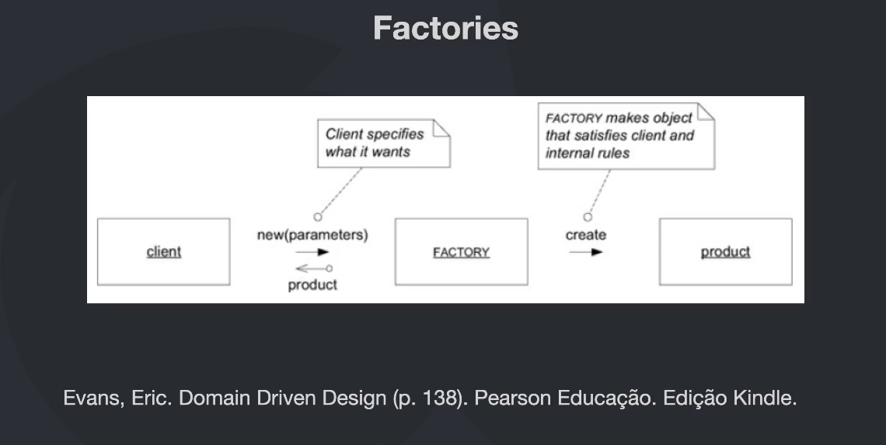

*Entidades*:
"Uma entidade é algo único que é capaz de ser alterado de forma contínua durante um longo período de tempo" - Vernon, Vaughn. Implementing Domain Driven Design
"Uma entidade é algo que possui uma continuidade em seu ciclo de vida e pode ser distinguida independente dos atributos que são importante para a aplicação do usuário. Pode ser uma pessoa, cidade, carro, um ticket de loteria ou uma transação bancária - Evans, Eric. Domain Drive Design (p. 91)

Entidade = IDENTIDADE

DTO -> Data Transfer Object (objeto burro para mandar de uma camada a outra)

Entidade Anêmica -> apenas carrega dados sem inteligência nenhuma apenas os gets, sets, sem regras de negócio, basicamente existe por causa do ORM
Regras de negócio -> Adicionar comportamentos na classe que traduzam as regras do negócio para aquela entidade, (importante se atentar a semantica, pensando na intenção do método)
 - Exemplo SetActive ou SetInactivate ao invés disso ser Activate ou Deactivate, ainda é sobre ativar ou não, mas a segunda forma tem uma grande diferença ela traduz a regra necessário o porque daquela alteração, essa abordagem expressando o negócio não apenas get e sets que deixam o DOMINIO RICO

A entidade precisa representar o estado correto e atual daquele elemento, 100% das vezes os dados devem estar consistentes

Principio da auto validação: para manter a consistência da classe a todo momento verificar que a mesma está correta, exemplo validação no construtor e na alteração do campo caso aquele campo tenha uma validação a aplicar

Lembrando que a entidade acaba fazendo parte do dominio, as regras de negócios e etc (complexidade de negócio) e tbm da infra pois a entidade é utilizada pelo ORM para armazenamento (complexidade acidental)

*Objetos de Valor (Value Objects, V.O)*:
"Quando você se preocupa apenas com atribuitos de um elemento de um model, classifique isso como um Value Object"
"Trate o ValueObject como imutável" (não muda, é trocado, ele representa apenas um propriedade)

Caso do endereço, é possível mudar a Cidade, sem mudar a rua e/ou o Estado ?, ele tem apenas um conjunto de propriedade que o representa, mas não precisa ser unico no sistema (claro q tem o contexto do sistema q as vezes tem q ser), mas é um conjunto de propriedades que deve ser imutavel

Caso do CPF, é uma propriedade que não é editável (ninguem muda um numero no CPF), é imutável, além de ter uma validação propria, então é um caso que pode ser um V.O e se auto validar

exemplo de V.O 19-ddd-modelagem-tatica-e-patterns/fc-ddd-patterns/src/domain/customer/value-object/address.ts, utilizado na classe customer.ts como o endereço do usuário

*Agregados (Aggregate)*:
"Um agregado é um conjunto de objetos associados que tratamos como uma unidade para propósito de mudança de dados"

Exemplo para criar uma compra é preciso de Cliente, Compra, Item de Compra e um endereço (do usuário para entrega), são entidades e/ou objetos de valor, 
mas para fazer uma compra acaba que precisamos de todos eles e podemos ter um objeto agregado (obs: não são todas informações, apenas as de indentificação e outras necessárias) com todas essas informações e realizar as persistências no meu sistema, exemplo abaixo
Order 
{
    id,
    customerId (Cliente),
    items (Item de Compra),
    address (endereco de entrega)
}

*Testes*: 
Resumo criação de testes para as entidades criadas respeitando as regras e validando as regras, reforçando o conceito de que a entidade sempre tem que estar válida (linha 13) nos testes fica clara esse conceito, 

*Domain Services*:    
"Um serviço de domínio é uma operação sem estado que cumpre uma tarefa específica do domnínio. Muitas vezes, a melhor indicação de que você deve criar um serviço no modelo do domínio é quando a operação que você precisa executar parece não se encaixar como um método em um Agregado ou em um Objeto de Valor" - Vernon, Vaughn. Implemeting Domain-Driven Design.

"Quando um processo ou transaformação signtificativa no domínio não for uma responsabilidade de uma entidade ou OBJETO DE VALOR, adicione uma operação ao modelo como uma interface autônoma declarada como um SERVIÇO. Defina a interface baseada na linguagem do modelo do domínio e certifique-se que o nome da operação faça parte da linguagem ubiquoa. Torne o serviço sem estado." Evans, Eric. Domain-Driven Design (p. 106)

    - Uma entidade pode realizar uma ação que vai afetar todas as entidades ?
    - Como realizar uma operação em lote ?
    - Como calcular algo cuja as informações constam em mais de uma entidade ?

    Cuidados:
    - Quando houver muitos Domain Services em seu projeto, TALVEZ, isso pode indicar que seus agregados estão anêmicos (tomar cuidado para não estar extraindo métoos que deveriam estar nas entidades para o serviço)
    - Domain Services são Stateless (eles não guardam estado), nenhum dado ficar armazenado num serviço de domínio

    Pratica:
        Realização de implementações de serviços, explicando o motivo de cada método e escrevendo testes

*Repositories (Repositórios)*:

"Um repositório comumente se refere a um local de armazenamento, geralmente considerado um local de segurança ou preservação dos itens nele armazenados.
Quando você armazena algo em um repositório e depois retorna para recuperá-lo, você espera que esteja no mesmo estado que estava quando você o colocou lá, Em algum momento, você pode optar por remover o item armazenado no repositório."
Vernon, Vaugn. Implementing Domain-Driven Design.

Pratica:
        Realização de implementações dos repositórios, explicando o motivo de cada método (utilizando Sequelize, interessante) e escrevendo testes

*Domain Events*:
"Use um evento de domínio de para capturar uma ocorrência de algo que acontece no domínio." - Vernon, Vaughn. Implementing Domain-Driven Design

"A essência de um evento de domínio é que você o usa para capturar coisas que podem desencadear uma mudança no estado do aplicativo que você está desenvolvendo. Esses objetos de evento são processados para causar alterações no sistema e armazenados para fornecer um AuditLog" - Fowler, Martin. Domain Event.

 - Todo evento deve ser representado em uma ação realizada no passado:
  - UserCreated
  - OrderPlaced
  - EmailSent
 - Quando utilizar ?
  - Normalmente um Domain Event deve ser utilizado quando queremos notificar outros Bounded Contexts de uma mudança de estado
 - Componentes:
  - Event
  - Handler: Executa o processamento quando um evento é chamado
  - Event Dispatcher: Responsável por armazenar e executar os handlers de um evento quando ele for disparado
 - Fluxo
  - Criar um "Event Dispacher" -> Criar um "Evento" -> Criar um "Handler" para o "Evento" -> Registrar o Evento, juntamente com o Handler no "Event Dispacher"
  - agora disparar um evento, basta executar o método "Notify" do dispatcher. Nesse momento todos os handlers registrados no eventos serão executados.

Pratica:
        Realização de implementações dos eventos e sua estrutura do 0, explicando o motivo de cada método (algo bem basico mais para ver a estrutura aplicada)
        - Exemplo de implementação de domain events https://github.com/devfullcycle/fc-ddd-patterns/tree/domain-events
        - Item negativo do modulo, faltou aplicar no contexto da aplicação tudo foi criado e testado, mas não exibido em qual camada é chamado

*Módulos*:
"Em um contexto DDD, módulos em seu modulo servem como contêiners nomeados para as classes de objetos que são altamente coesas entre si. O objetivo deve ser baixo acoplamento entre as classes que estão em módulos diferentes. Como os módulos usados no DDD não são compartimentos de armazenamento anêmicos ou genéricos, também é importante nomear adequadamente os módulos. Vernon, Vaughn. Implementando Design Orientado a Domínio.
 - Respeitar a linguagem universal
 - Baixo acoplamento
 - Um ou mais agregados devem estar juntos somente se fazem sentido
 - Organizado pelo domínio/subdomínio e não pelo tipo de objeto
 - Devem respeitar a mesma divisão quando estão em camadas diferentes

*Factories*:
"Desloque a responsabilidade de criar instâncias de objetos complexos e AGREGADOS para um objeto separado, que não pode ter responsabilidade no modelo de domínio para um objeto separado, que não pode ter responsabilidade no modelo domínio, mas ainda faz parte do design de domínio. Forneceça uma interface que encapsule toda a criação complexa e que não exija que o cliente faça referência ás classes concretas dos objetos que estão sendo instanciados. Crie AGGREAGATES inteiro de uma única vez, reforçando suas invariantes" - Evans, Eric. Domain-Driven Design (p.138)

Pratica:
    - implementação de alguns exemplos de factories, em todos modulos, com variações de implementações mostrando o quanto o pattern ajuda

---------------------------------
Resumo desse módulo: muito bom, focado nos conceitos e uma implementação básica deles, gostei, mas preferiria que isso saisse com uma aplicação rodando mesmo q um crud muito bombado, porque não fica algo em que posso fazer como o events q foi aplicado e testado, mas ficou sem uso real na aplicação, mas as explicações são muito boas e as implementações também.